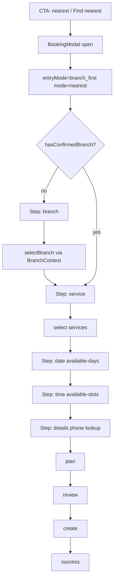
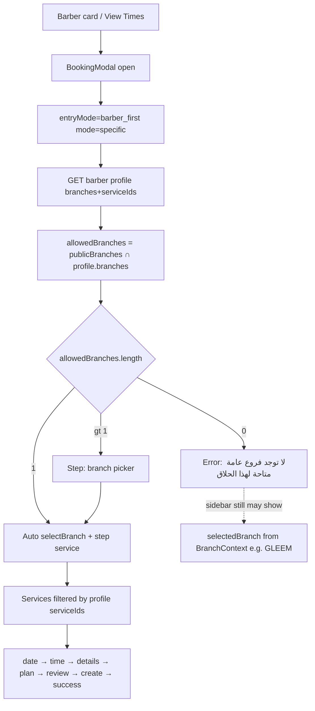
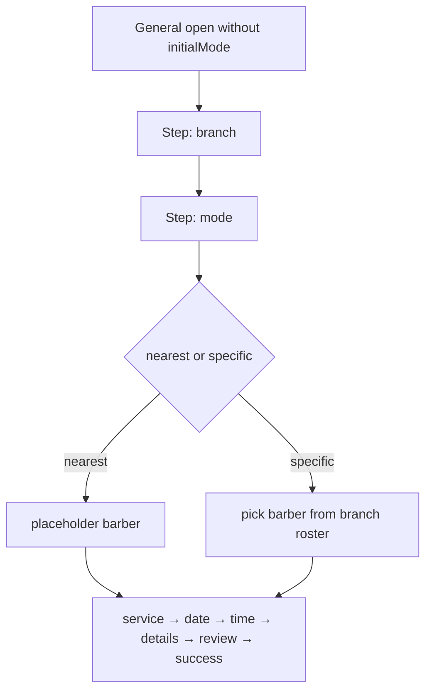

# Current Booking Flow Map

## Entry modes

| Entry | Source | `entryMode` | `initialMode` | Starts at |
|-------|--------|-------------|---------------|-----------|
| Barber card (AR) | `BarbersSection.openBarberFirst` | `barber_first` | `specific` | branch (or auto service) |
| Barber chip (Hero) | `cut:book-barber` → name match | `barber_first` | `specific` | branch |
| EN View Times | `EnglishHome.openBooking(..., "specific")` | `barber_first` | `specific` | branch |
| Nearest CTA | `cut:book-nearest` / EN Find Nearest | `branch_first` | `nearest` | branch |
| Branch Book at This Branch | EN branches | `branch_first` | `nearest` | branch (branch preselected) |
| Groom | `cut:book-groom` + service preselect | `branch_first` | `nearest` | may jump to date after services |
| BookingCTA / Nav Book | scroll `#barbers` / `#english-barbers` | — | — | no modal |

## UI step machine

```
branch → [mode?] → service → date → time → details → review → success
                      ↘ slots (legacy cross-branch panel; goToSlotsStep currently lands on "date")
```

`mode` is skipped when `initialMode` is set or `entryMode === "barber_first"`.

## Mermaid — nearest-slot (branch_first)



## Mermaid — barber-first



## Mermaid — branch-first without initialMode



## Observed live results (2026-08-05)

| Flow | Result |
|------|--------|
| Ahmed barber-first | Stuck on branch with empty public branches; sidebar shows جليم – سابا باشا |
| Mahmoud barber-first | Auto-resolves GLEEM → service step |
| EN View Times (Ziad) | English page + Arabic modal (`احجز مع Ziad`) + dual Close |

## Screenshots

- `screenshots/ar-booking-ahmed-no-public-branches.png`
- `screenshots/ar-booking-mahmoud-service-auto-gleem.png`
- `screenshots/en-home-opens-arabic-modal-ziad.png`
- Prior step captures: `ar-booking-step-*.png`, `mahmoud-step-*.png`
